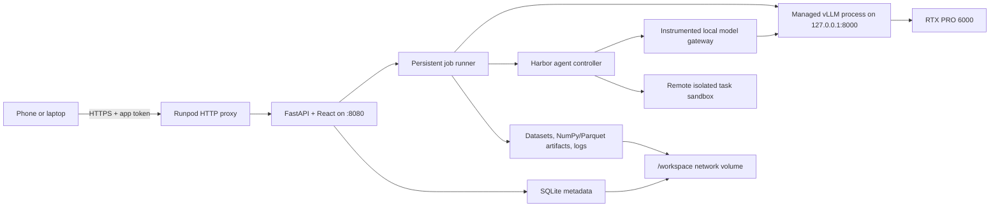

# MoE Tools Test Suite Roadmap

Status: planning document, updated 2026-08-08

Implementation status as of 2026-08-08:

- **Milestone 0 complete:** the repository now contains a tested FastAPI backend,
  fork-compatible telemetry decoder/aggregator and profile validator, deterministic
  A3B mock runtime, selectable fixture benchmark, responsive React application,
  40-by-256 engagement heatmap, fixed-budget profile proposal, and Runpod-aware
  Dockerfile skeleton.
- **Verified locally:** 10 backend tests, Ruff, the production TypeScript/Vite build,
  desktop and 390-pixel browser workflows, shell startup syntax, and Docker Buildx
  static validation all pass.
- **Next:** authenticated Runpod appliance and durable state, followed by managed
  vLLM lifecycle against the target GPU. The current Runpod image intentionally
  defaults to mock mode until those runtime controls are complete.

This repository will contain a single-user research application for measuring how
expert eligibility changes affect a task-focused MoE model. The first useful
vertical slice is:

1. launch one repeatable Runpod Pod;
2. load the supported Qwen model;
3. run a fixed benchmark cohort while capturing expert routing;
4. inspect engagement and create an expert profile;
5. restart the model with that profile;
6. rerun the identical cohort and compare quality and behavior.

The application should make this loop easy and reproducible without hiding the
experimental constraints of the current fork.

## What already exists in `vllm-moe-tools`

The implementation plan is based on the local `stage_2` branch at commit
`79df5217e` (also `origin/stage_2`). That history contains three relevant pieces:

- Version 1 expert-selection profiles with per-layer logical expert allowlists.
- Routed-expert capture returned through the OpenAI-compatible completions and
  chat-completions APIs.
- Float32 routing weights paired element-for-element with the routed expert IDs.

The runtime flags exposed by the fork are:

```text
--enable-return-routed-experts
--enable-return-routed-expert-weights
--moe-expert-selection-profile /path/to/profile.json
```

Telemetry is transported as base64-encoded NumPy arrays. IDs and weights have
shape `[tokens, routed_layers, top_k]`. The app will decode and aggregate these
arrays rather than changing vLLM's internal capture path in the first phase.

The profile contract is intentionally small:

```json
{
  "version": 1,
  "layers": {
    "0": { "keep": [0, 1, 2, 3, 4, 5, 6, 7] }
  }
}
```

The fork validates layer IDs, expert IDs, duplicates, minimum `top_k`, and router
compatibility. It applies the eligibility mask before top-k selection and fails
closed on unsupported routing implementations.

### Important current limitations

- Profiles are bound during model load. Changing a profile means restarting the
  vLLM model process; this is not currently a hot runtime setting.
- Ineligible experts remain loaded. The current feature is behavioral pruning,
  not checkpoint compaction, expert offload, or a direct VRAM reduction.
- Routed telemetry has measurable memory, transport, and latency overhead. Quality
  runs should compare like with like; clean performance runs should disable capture.
- The exact modular/monolithic backend selected on the target GPU must be verified
  from the real startup logs. Eligibility deliberately rejects unsupported paths.
- The fork already contains a Runpod development image and shell wrappers. The app
  image should reuse their validated CUDA/PyTorch/precompiled-extension choices
  instead of independently inventing a second vLLM runtime.

These limitations will be visible in the UI. The product will use **masked** or
**eligible** for the current behavior and reserve **physically pruned** for a future
artifact that actually removes, compresses, or offloads weights.

## Product scope

### MVP goals

- Start the app from a custom Runpod Pod template.
- Reach it securely from a phone or laptop without an extra tunneling service.
- Select and load a model from a registry that initially exposes one enabled model.
- Show model lifecycle, hardware, runtime configuration, and MoE topology.
- Provide a compact chat interface for smoke tests.
- Browse, filter, sample, and manually select benchmark items.
- Run benchmark items as a durable background job with item-level progress.
- Record score, output, latency, errors, and expert routing for each item.
- Explore layer/expert engagement using a scalable interactive heatmap.
- Create, validate, clone, import, and export expert profiles.
- Restart the model with a profile and rerun an identical benchmark cohort.
- Compare base and masked runs with paired item-level and aggregate views.
- Persist datasets, model cache, runs, profiles, logs, and provenance across Pods.
- Treat multi-turn agentic coding as a first-class benchmark family after the
  baseline one-request evaluation loop is reliable.
- Preserve complete agent trajectories and associate every model inference with its
  expert-routing telemetry.

### Explicitly deferred

- Multiple simultaneous models or multiple concurrent GPU workers.
- Multi-user accounts, teams, and remote authorization providers.
- Physically rewriting checkpoints or proving VRAM savings from eligibility masks.
- Hot-swapping expert profiles without reloading vLLM.
- Automated black-box search over thousands of masks.
- Executing model-generated code inside the main application/model container.
- Multi-node or tensor-parallel deployments.
- Selective quantization. The data model will leave room for it, but the first UI
  will not pretend that it is implemented.

## Decisions

### Deployment: persistent Runpod Pod

A Pod is a better fit than Runpod Serverless because the workflow is interactive,
stateful, and holds a large model warm while the user explores results. Serverless
would add cold starts and an awkward request/job boundary without removing the need
for persistent research artifacts.

The deliverables will include:

- one `linux/amd64` application image with immutable tags;
- a custom Pod template definition and a console setup guide;
- an optional script/API path to create or update the template;
- a bounded GPU acceptance checklist and cost/teardown guidance.

Initial template configuration:

| Setting | Initial value |
| --- | --- |
| GPU | 1x RTX PRO 6000 Blackwell Server Edition, 96 GB |
| App HTTP port | `8080/http` |
| SSH | `22/tcp`, for maintenance only |
| Internal vLLM port | `8000`, not publicly exposed |
| Container disk | 50 GB minimum |
| Persistent storage | 150 GB network volume mounted at `/workspace` |
| App data | `/workspace/moe-tools` |

The GPU's data center should be checked before creating the network volume because a
Runpod network volume is tied to one data center and restricts GPU placement.

### External access: Runpod HTTP proxy, not ngrok

The default URL will be:

```text
https://<pod-id>-8080.proxy.runpod.net
```

This is the best initial option because it is built into Pod templates, provides
HTTPS, requires no tunnel account or sidecar, and works from mobile and desktop
browsers. The proxy is public and does not add authentication, so the application
will require a user-supplied access token. After token entry it will issue an
`HttpOnly`, `Secure`, same-site session cookie; the token will not be placed in the
URL or stored in browser local storage.

The proxy has a 100-second connection limit. Model loads and benchmark runs will
therefore return a job ID immediately and expose short polling endpoints. Chat can
stream when practical but must degrade cleanly to polling. No core operation will
depend on a long-lived browser connection.

ngrok is not part of the default architecture. A custom domain or an identity-aware
proxy can be added later without changing the application because the frontend and
API are served from one origin.

### Application stack

**Backend:** Python 3.12, FastAPI, Pydantic, SQLAlchemy, and SQLite with one
application writer.

Python is the natural control plane for NumPy telemetry, Hugging Face datasets, and
vLLM process management. SQLite avoids running Redis or Postgres on a single-user,
single-Pod appliance. The database will use a rollback journal on the network volume
unless a target-filesystem test proves WAL locking is safe; SQLite WAL is not assumed
safe on network filesystems. Large artifacts will be files, not database blobs.

**Frontend:** React, TypeScript, Vite, Tailwind CSS, Radix primitives, TanStack Query,
and Apache ECharts.

ECharts will render the 40-by-256 expert matrix on canvas, with zoom, filtering,
tooltips, selection, and mobile support. The production frontend will compile to
static files served by FastAPI so the public app is same-origin and only needs one
HTTP port.

**Visual direction:** warm off-white surfaces, ink-like text, restrained terracotta
and ochre accents, bundled serif display/body typography with a clean sans-serif for
data-dense controls, generous spacing, and minimal chrome. The tone should feel
homey and editorial while tables, filters, progress, and plots remain unambiguous.
Color will never be the only carrier of mask or score state.

The primary navigation will stay small:

- **Model:** load state, topology, runtime facts, and chat;
- **Benchmarks:** dataset browser, cohorts, and new-run setup;
- **Runs:** progress, results, routing analytics, and exports;
- **Profiles:** manual/assisted selection and profile history;
- **Compare:** paired base-versus-variant results;
- **System:** storage, logs, versions, security, and shutdown controls.

Desktop uses a quiet left rail; mobile uses a compact bottom bar and full-screen
drawers for expert details rather than shrinking desktop panels beyond usability.

### One app process, one managed vLLM child process

The app will own the model lifecycle instead of asking the user to manage shell
commands. Only one vLLM server can be ready at a time on the single GPU.



Model states will be explicit: `unloaded`, `starting`, `ready`, `stopping`, and
`failed`. Startup logs and readiness checks will stream into a persistent session
record. A profile or telemetry-mode change creates a new model session and restarts
vLLM. The UI will show this restart before the user confirms it.

The Runpod base image's `/start.sh` must remain in the startup chain so SSH and the
standard Pod services are not accidentally removed. An idempotent startup hook will
launch the web application automatically.

### Agentic execution: Harbor controller plus remote sandboxes

Runpod Pods run from custom container images and do not provide a Docker daemon or
Docker Compose inside the GPU Pod. Agent-generated code and benchmark verifiers must
therefore not be run by trying to add Docker-in-Docker to the application image.

The application will embed a pinned
[Harbor](https://github.com/harbor-framework/harbor) controller. Harbor will manage
the agent loop and use a cloud sandbox provider for each isolated task environment.
Daytona is the initial provider choice because Harbor recommends it for horizontal
agent evaluation and it supports both single- and multi-container tasks. The provider
boundary remains configurable so Modal, E2B, Runloop, EC2, or another Harbor backend
can be added later.

The initial agent scaffold will be a pinned, minimal bash-oriented loop modeled on
Mini-SWE-Agent and implemented as an external Harbor agent. Its control process stays
inside the application Pod, calls vLLM over loopback, and sends only shell operations
to the remote sandbox. This has three advantages:

- the model endpoint remains private and is not exposed to the sandbox or internet;
- every inference passes through one instrumented gateway that can decode routing;
- the scaffold is small enough that model/profile effects are not buried under a
  complicated agent implementation.

Harbor's Terminus-2 and installed agents such as Aider or OpenHands can be added as
explicit alternative scaffolds. Results from different scaffolds will never be
silently pooled. The measured system is always `model + expert profile + agent
scaffold + tools + prompt + budget + sandbox + benchmark revision`.

The sandbox provider API key remains in the controller and is never passed to the
agent task. Network access will be disabled or allowlisted after environment setup
whenever the benchmark permits it. Sandbox lifecycle, timeout, CPU/RAM/disk limits,
and deletion are part of the durable job state.

### Model registry

The backend will use a model registry even though the first release has one enabled
entry. A registry entry will contain:

- Hugging Face model ID and optional pinned revision;
- display name and enabled/experimental status;
- vLLM arguments and default generation parameters;
- minimum GPU memory and recommended context limit;
- expected topology fields and a topology extractor;
- compatibility notes for telemetry, masking, quantization, and chat features.

The app will derive actual topology from the downloaded model configuration and
runtime facts, not hard-code the UI to 40 layers or 256 experts. A mismatch between
expected and actual topology will prevent profile application.

### Repository and image relationship

`moe-tools-test-suite` remains a separate product repository. The final image will
contain both repositories, with the fork pinned by full commit SHA. For local builds,
BuildKit will receive the sibling `../vllm-moe-tools` checkout as a named build
context. CI will check out the same pinned fork revision before building.

The image will build for `linux/amd64`, preserve the validated Runpod CUDA 13/PyTorch
2.9 base and precompiled-extension strategy from `docker/Dockerfile.runpod`, and copy
application code after heavy dependency layers. It will never use a floating
`latest` tag. Model weights, datasets, results, and caches will stay out of the image
and on `/workspace`.

The default registry target can be GHCR, while image coordinates remain configurable
for Docker Hub or another registry.

## Benchmark plan

The core abstraction is a benchmark adapter, not a hard-coded GSM8K screen. Each
adapter owns:

- dataset ID, revision, subset, split, and license metadata;
- item schema and searchable/filterable fields;
- stable item IDs;
- prompt rendering and prompt-template version;
- recommended deterministic generation settings;
- response parsing and scoring;
- aggregate and per-category metrics.

The runner will issue one OpenAI-compatible request per item in the first version.
This makes progress, cancellation, retry, scoring, and routing provenance easy to
understand. Controlled concurrency can be added after correctness is established.

### Initial benchmark options

| Benchmark | Purpose | Scoring | Phase |
| --- | --- | --- | --- |
| GSM8K | Small, interpretable math/reasoning smoke test | Extracted final-answer exact match | First vertical slice |
| Custom JSONL | User's actual target workflow | Exact, regex, multiple choice, or unscored review | First vertical slice |
| MMLU/MMLU-Pro | Subject-filterable knowledge and reasoning | Multiple-choice accuracy | Next adapter |
| IFEval | Instruction-following sensitivity | Published rule-based checks | Next adapter |
| Aider Polyglot | Fast multi-language code-editing and agent-harness smoke test | Executable verifier pass and agent-attempt metrics | First agentic adapter |
| FeatureBench Fast | Repository-level feature implementation | Published executable verifier and partial metrics | Primary agentic coding suite |
| Terminal-Bench 2.1 | Long-horizon terminal and engineering workflows | Per-task verifier reward and `pass@k` | Primary agentic breadth suite |
| Custom Harbor tasks | The user's actual repository and agentic workflows | User-authored executable verifier | First-class agentic feature |
| Random/ShareGPT | Serving throughput only | Latency and throughput, not quality | Performance mode |

GSM8K is the right first standardized adapter because item scoring is cheap and the
full baseline-to-profile loop can be tested without executing generated programs.
Custom JSONL is equally important to the product goal: specialization is only useful
if users can bring examples from the task they actually care about.

### Agentic coding benchmark strategy

Agentic coding is a major product track, but it should not be reduced to one
leaderboard number. The suite will use a ladder whose rungs stress different failure
modes and costs.

#### 1. Aider Polyglot: integration and quick regression

Aider Polyglot contains 225 executable Exercism tasks across C++, Go, Java,
JavaScript, Python, and Rust. It is not a faithful substitute for long-horizon
repository work, but it is the best first integration target because it is small,
test-driven, multi-language, available through Harbor, and cheap enough for repeated
base/profile smoke cohorts.

Initial use:

- pin the Harbor dataset revision and the default external agent revision;
- ship a curated 12-task smoke cohort spanning the six languages;
- allow the complete 225-task cohort after the sandbox path is stable;
- report task pass rate, first-attempt/final pass, malformed tool actions, turns,
  tokens, commands, wall time, and routing engagement;
- optionally add Aider itself as a separately fingerprinted scaffold for comparison
  with the benchmark's native harness; do not pool those results with the default
  agent.

#### 2. FeatureBench Fast: primary feature-development signal

FeatureBench measures complex feature implementation rather than only bug repair. Its
Fast split has 100 CPU-only instances and is designed for quicker evaluation, while
the broader benchmark includes longer and GPU-dependent tasks. It already supports
Mini-SWE-Agent, OpenHands, Codex, and other mainstream scaffolds, and Harbor documents
a FeatureBench adapter.

Initial use:

- use only the pinned CPU Fast split so the RTX PRO 6000 remains dedicated to vLLM;
- begin with a manually verified 10-task cohort covering different repositories and
  feature shapes;
- preserve the benchmark's own passed/resolved and partial verifier outputs;
- expand to the full Fast split after oracle verification on the chosen sandbox.

This is the most relevant public benchmark for the stated goal because feature work
requires codebase discovery, planning, multi-file editing, tests, and recovery over a
longer trajectory.

#### 3. Terminal-Bench 2.1: terminal autonomy and workflow breadth

Terminal-Bench 2.1 is the corrected, continuously validated revision of Terminal-
Bench 2.0. Its 89 tasks cover debugging, building, data processing, security, Git,
servers, and other realistic terminal work. Not every task is software development,
so the application will expose task metadata and ship a coding/engineering-focused
cohort before offering the complete set.

Initial use:

- pin `terminal-bench/terminal-bench-2-1` and its Harbor revision;
- curate an approximately 15-task engineering cohort with verified oracle success on
  the selected sandbox provider;
- use the minimal agent scaffold for model-centered comparisons and Terminus-2 as an
  optional standard-scaffold comparison;
- use one attempt for exploration, at least three for profile confirmation, and five
  only for an official leaderboard-compatible experiment.

Terminal-Bench 3 is still under construction as of this roadmap update, so it is not
a reproducibility target yet.

#### 4. Custom Harbor tasks: task-specific specialization

Public benchmarks are useful calibration, but the product's purpose is to specialize
models for a real workflow. The app will therefore support importing or authoring a
Harbor-compatible task pack with:

- a repository snapshot or pinned source revision;
- a natural-language instruction and optional context files;
- container/environment definition;
- setup, test, and verifier commands;
- timeout and resource limits;
- optional oracle solution for environment validation;
- tags such as language, repository, task type, and difficulty.

The UI will validate that the oracle passes and a no-op fails before a custom task is
eligible for profile-selection runs. Private source code is sent to the configured
sandbox provider, so the UI must display that data boundary and later support a
self-hosted provider for sensitive repositories.

#### 5. Later research/reference suites

- **SWE-rebench V2:** promising for fresher, contamination-aware, multi-language
  repository tasks. Add it after its task images and evaluator are proven against a
  pinned Harbor adapter/provider combination.
- **SWE-Lancer Diamond:** valuable for larger freelance feature/bug tasks and
  economic-value scoring, but expensive enough to remain a later validation suite.
- **SWE-bench Verified:** retain only for historical comparability. It is increasingly
  contaminated and an audit found many residual test/specification problems.
- **SWE-bench Pro:** retain as an opt-in reference with prominent warnings. A July
  2026 audit estimated roughly 30% of the public tasks are broken and retracted an
  earlier recommendation to use it as the primary successor to SWE-bench Verified.
- **HumanEval/LiveCodeBench-style generation:** useful one-request coding controls,
  but they do not measure repository navigation or agent recovery and are not a
  substitute for the agentic track.

No expert profile will be presented as “coding-specialized” from a single public
suite. A candidate coding profile should train its selection statistics on one or
more target cohorts and be validated on a held-out task pack from a different source.

### Agentic run contract

An agentic task is one benchmark item with multiple model calls and environment
actions. The controller will store the complete Harbor Agent Trajectory Interchange
Format (ATIF) record plus:

- benchmark/task/environment image revision and verifier result;
- agent name, source revision, prompt, tool schema, and all agent arguments;
- turn, token, inference, command, test, timeout, and wall-clock budgets;
- each thought/message, tool or shell action, observation, exit code, and truncation;
- final patch/repository diff and collected verifier artifacts;
- one inference record per model call linked to routing IDs/weights;
- task reward, partial metrics, termination cause, and sandbox/provider metadata.

Every model turn passes through an instrumented local gateway. It forwards the
request to vLLM, decodes the fork's custom routing arrays, stores them against the
trajectory step, and returns the ordinary model response to the agent. The initial UI
will aggregate engagement per inference, turn, and complete episode.

Multi-turn prompts often repeat conversation history, so raw routing counts can
double-count earlier context. The product will label the initial aggregate as
**served-token engagement**. Generated-token-only, novel-context, and semantic phase
views will ship only after token-span alignment is verified against the fork. Until
then, profile proposals can filter by episode success and turn number but will not
claim that repeated prompt tokens are unique evidence.

Agentic comparison requires a stricter compatibility fingerprint than one-request
evaluation. It includes the benchmark/task revision, environment image digest,
verifier, agent/scaffold revision, system prompt, tool schema, generation settings,
turn/token/time budgets, sandbox provider, network policy, and attempt seed. A base
and masked run with different scaffolds or budgets is not a paired comparison.

Agent outcomes are stochastic even at low temperature. Exploratory runs may use
`pass@1`; conclusions about a profile should use repeated attempts and report
`pass@k`, mean reward, confidence intervals, and success/failure transitions. The UI
will never silently mix task attempts or choose the best attempt after the fact.

The benchmark browser will support split/category filters, text search, seeded
sampling, manual checkboxes, select-all-from-filter, and saved cohorts. A run stores
the exact selected item IDs; a masked rerun defaults to that immutable cohort.

### Reproducibility contract

Every run will record:

- application, image, and fork commit/digest;
- model ID, Hugging Face revision, and model-config hash;
- GPU name, VRAM, driver, CUDA, PyTorch, and vLLM versions;
- effective vLLM arguments and backend selection from startup logs;
- dataset ID, revision, split, selected item IDs, and local snapshot hash;
- prompt-template/scorer version and generation parameters;
- seed, start/end times, failures, and cancellation reason;
- exact expert-profile JSON and hash, or `baseline`;
- telemetry mode and raw-artifact retention policy.

The comparison screen will calculate a compatibility fingerprint. It will warn or
refuse a strict paired comparison when dataset items, prompts, model revision, or
generation parameters differ.

### Quality and performance are separate run modes

- **Analysis run:** routing IDs and weights enabled; quality score and expert
  engagement are valid; latency is diagnostic only.
- **Performance run:** routing capture disabled; use vLLM's serving benchmark path;
  collect throughput, total latency, and GPU metrics.

This prevents the application from presenting capture overhead as a pruning effect.

## Expert analytics and profile creation

### Stored analytics

Raw telemetry can grow quickly, so the backend will aggregate during each item and
store optional compressed raw arrays outside SQLite. Initial metrics are:

- selection count and selection rate by layer/expert;
- summed routing weight (routing mass);
- mean weight conditional on selection;
- number and percentage of items touching each expert;
- per-layer entropy/concentration and active-expert count;
- co-selection counts for selected drill-downs;
- correct-versus-incorrect engagement slices;
- successful-versus-failed agent trajectory engagement;
- per-turn and per-inference engagement for agentic tasks;
- base-versus-masked routing overlap and redistribution.

Token-phase or token-text views will only ship after an integration test proves the
alignment between API token IDs and every telemetry row for the target model. The
initial contract is item- and layer-level aggregation.

### Profile editor

The main view will be a zoomable layer-by-expert heatmap with linked summary charts.
Users can click, brush, select rows/columns, inspect an expert, undo/redo, and clone a
profile. The UI will always show:

- eligible experts per layer and total eligible slots;
- required minimum (`top_k`) and any grouped-router constraints;
- observed routing mass and item coverage retained by the current selection;
- experts never observed in the selected run;
- a clear statement that current estimated parameter reduction is theoretical.

Profiles are immutable after use in a run. Editing creates a new revision. Import and
export use the fork's exact version 1 JSON format.

### Assisted selection strategies

The first useful strategies are deterministic and explainable:

1. **Fixed budget:** keep the top `K` experts by selection count or routing mass in
   every layer.
2. **Cumulative mass:** keep the smallest set per layer that covers a requested
   percentage of observed routing mass, with a `top_k` floor.
3. **Item coverage:** greedily retain experts that preserve a requested amount of
   the observed routed slots across the chosen items.
4. **Correct-only emphasis:** rank from correct items, while displaying what routing
   mass from incorrect items would be lost.
5. **Target lift (later):** compare a target cohort with a general/reference cohort
   and favor experts disproportionately engaged by the target task.
6. **Successful trajectory emphasis (agentic):** rank from successful attempts while
   preserving a held-out task pack and displaying engagement lost from failed or
   recovery-heavy trajectories.

Each proposal produces a preview, rationale, coverage metrics, validation results,
and a diff from its parent profile. Assisted selection will not claim causal expert
importance; only ablation or masked reruns provide causal evidence.

## Result and comparison experience

A run detail page will show status, provenance, aggregate score, category scores,
per-item outputs, errors, engagement, and its exact model variant.

A paired comparison will show:

- base score, masked score, absolute delta, and relative delta;
- paired bootstrap confidence interval when sample size permits;
- item transitions: pass-to-pass, pass-to-fail, fail-to-pass, fail-to-fail;
- filterable per-item output diffs;
- eligible expert counts by layer and theoretical retained expert fraction;
- routing concentration and base/masked overlap;
- for agentic runs: task reward, `pass@k`, turns, commands, test attempts, token
  usage, termination causes, patch statistics, and trajectory-step routing;
- diagnostic latency for analysis runs or clean performance metrics for performance
  runs;
- provenance mismatches and warnings.

The primary action on a baseline analysis run is **Create expert profile**. The
primary action on a profile is **Load and rerun cohort**. The app will make that
workflow obvious without preventing ad hoc exploration.

## Persistence model

SQLite stores relational metadata and state. Files under `/workspace/moe-tools`
store larger or portable artifacts.

Proposed entities:

- `model_sessions`: model/profile/runtime lifecycle and logs;
- `dataset_snapshots`: dataset revision, local files, and content hash;
- `benchmark_cohorts`: immutable selected item IDs and filters;
- `benchmark_runs`: configuration, status, score, and provenance;
- `run_items`: prompt, response, parsed answer, score, timing, and error;
- `agent_trials`: scaffold, sandbox, budgets, reward, termination, patch, and
  verifier metadata for a multi-turn task attempt;
- `trajectory_steps`: normalized ATIF messages, actions, observations, and metrics;
- `inference_calls`: model request/response metadata linking a trajectory step to
  routed-expert artifacts;
- `sandbox_sessions`: provider lifecycle, resource limits, image digest, and cleanup
  state without persisted provider secrets;
- `routing_summaries`: aggregate layer/expert statistics;
- `routing_artifacts`: paths and hashes for compressed per-item arrays;
- `expert_profiles`: immutable profile revisions and lineage;
- `jobs`: durable model-load, benchmark, aggregation, and export work.

A future `model_variants`/`interventions` layer can associate a run with expert
eligibility, selective quantization, offload, or a physically materialized
checkpoint without changing the benchmark and comparison tables.

Large arrays will use compressed NumPy initially; Parquet will be used for tabular
aggregates and exports. The app will expose a JSON/CSV/Parquet export so results are
not trapped in the UI.

## API shape

The initial internal API will be resource-oriented and job-based:

```text
POST /api/session/login
GET  /api/system/status
GET  /api/models
POST /api/model-sessions
GET  /api/model-sessions/{id}
POST /api/model-sessions/{id}/stop
POST /api/chat

GET  /api/benchmarks
GET  /api/benchmarks/{id}/items
POST /api/cohorts
POST /api/runs
GET  /api/runs/{id}
POST /api/runs/{id}/cancel
GET  /api/runs/{id}/routing
GET  /api/runs/{id}/items
GET  /api/runs/{id}/trials
GET  /api/trials/{id}/trajectory
GET  /api/trials/{id}/artifacts

GET  /api/agents
GET  /api/sandbox-providers
POST /api/agent-task-packs/validate
POST /api/agent-task-packs

POST /api/profiles/propose
POST /api/profiles
GET  /api/profiles/{id}
POST /api/profiles/{id}/validate
POST /api/comparisons

GET  /api/jobs/{id}
GET  /healthz
GET  /readyz
```

The browser will poll model sessions, jobs, and runs. Endpoint contracts will be
specified in OpenAPI and consumed by a generated TypeScript client.

## Implementation milestones

### Milestone 0: contracts and local skeleton

- Establish `backend/`, `frontend/`, `docker/`, `scripts/`, and `tests/` layout.
- Pin Python and Node dependencies; use `uv` for Python commands.
- Add model-registry, profile, run, and routing schemas.
- Build a fake vLLM server fixture that returns realistic base64 `.npy` telemetry.
- Add a synthetic model topology and benchmark fixture for GPU-free development.
- Add CI for backend tests, frontend tests, linting, and an amd64 image build.

Acceptance: a developer can run the app locally in mock mode, view a synthetic model,
run fixture items, and create a valid version 1 profile.

### Milestone 1: Runpod appliance and secure access

- Layer the app over the fork's validated Runpod runtime.
- Preserve `/start.sh`; add an idempotent app startup hook.
- Serve frontend/API on `0.0.0.0:8080`; keep vLLM on loopback port 8000.
- Add access-token login, secure cookies, CSRF protection, input limits, and basic
  rate limiting.
- Persist logs, state, and caches under `/workspace/moe-tools`.
- Add template definition, environment-variable reference, build/push script, and
  launch/teardown documentation.
- Add health/readiness endpoints and an outside-the-Pod proxy smoke test.

Acceptance: a fresh Pod created from the template exposes a login screen at the
Runpod proxy URL, survives an app restart, and does not expose vLLM publicly.

### Milestone 2: model lifecycle, topology, and chat

- Implement the one-model registry and managed vLLM subprocess.
- Surface download/startup progress, tail logs, errors, cancellation, and readiness.
- Parse actual model topology and runtime/backend details.
- Render the topology summary and empty expert matrix.
- Add a small chat interface with clear model/profile state.
- Reconcile interrupted model sessions after app or Pod restarts.

Acceptance: the supported Qwen model can be selected, loaded, inspected, chatted
with, stopped, and reloaded from the UI.

### Milestone 3: benchmark engine and routed telemetry

- Implement durable serialized jobs and item-level progress.
- Add benchmark browsing, cohort selection, GSM8K, and Custom JSONL.
- Decode, validate, and aggregate expert ID/weight arrays per item.
- Store full run provenance and optional compressed raw telemetry.
- Add run detail, item inspection, error handling, cancellation, and export.
- Establish deterministic benchmark defaults for comparison runs.

Acceptance: a selected 10-item GSM8K cohort produces a score, item results, and a
40-by-256 engagement view after browser refresh or reconnect.

### Milestone 4: profile lab

- Implement the canvas heatmap and linked metrics.
- Add manual selection, bulk actions, undo/redo, validation, lineage, import/export,
  and immutable revisions.
- Add fixed-budget, cumulative-mass, and item-coverage proposals.
- Preview observed coverage and theoretical retained expert fraction.
- Make router constraints and unsupported backends actionable.

Acceptance: a user can turn a baseline run into a valid profile without editing JSON,
while still being able to inspect and override every assisted choice.

### Milestone 5: masked rerun and comparison

- Restart vLLM with the selected profile and record a new model session.
- Clone the original cohort and exact run configuration.
- Run the masked benchmark with live progress.
- Add compatible-run checks, paired score analysis, item transitions, output diffs,
  routing redistribution, and exportable comparison reports.
- Add a capture-disabled performance path using the existing vLLM benchmark wrapper.

Acceptance: from one baseline run, a user can create a profile, load it, rerun the
same cohort, and understand both the quality delta and eligibility reduction.

### Milestone 6: agentic coding foundation

- Pin Harbor, the default external agent scaffold, ATIF schema, and sandbox-provider
  dependencies.
- Add Daytona configuration and credential checks without passing its API key to
  task environments.
- Implement the instrumented local model gateway and link every agent inference to
  routed-expert artifacts.
- Add durable sandbox/trial lifecycle, cancellation, timeout, cleanup, and orphan
  reconciliation.
- Add three tiny custom agent tasks whose oracle passes and no-op fails for fast
  end-to-end testing.
- Add Aider Polyglot and its 12-task smoke cohort.
- Add a trajectory viewer with turns, commands, observations, patch, verifier output,
  token/budget usage, and per-turn expert engagement.
- Extend comparison fingerprints and exports with scaffold/environment metadata.

Acceptance: a baseline and masked model can run the identical 12-task Aider cohort in
isolated remote sandboxes, retain complete trajectories and routing for every model
call, clean up every sandbox, and produce a valid paired comparison.

### Milestone 7: repository-level agentic coding

- Add FeatureBench Fast with a verified 10-task starter cohort and full Fast split.
- Add Terminal-Bench 2.1 with a verified coding/engineering cohort and full dataset
  access.
- Add Harbor-compatible custom task-pack authoring/import and oracle/no-op checks.
- Add repeated attempts, `pass@k`, mean reward, bootstrap intervals, and explicit
  attempt pairing.
- Add successful-trajectory and target-versus-reference profile proposals.
- Add sandbox resource/cost estimates, concurrency controls, preflight image checks,
  controlled network policies, and artifact retention settings.
- Add Terminus-2 as a second pinned scaffold without pooling it with the default.
- Evaluate SWE-rebench V2 and SWE-Lancer Diamond as later adapters; keep SWE-bench
  Verified/Pro reference-only with data-quality warnings.

Acceptance: a user can derive a profile from one agentic coding task pack, validate it
on a held-out repository-level pack, and inspect whether quality loss comes from model
answers, tool use, recovery behavior, budget exhaustion, or verifier/environment
failure.

### Milestone 8: benchmark breadth and hardening

- Add MMLU/MMLU-Pro and IFEval adapters.
- Add target-versus-reference assisted selection.
- Add storage retention controls, backup/export/import, and migration tooling.
- Add responsive Playwright coverage for phone and laptop layouts.
- Add failure-injection tests for model OOM, bad profiles, corrupt telemetry,
  interrupted jobs, proxy reconnects, and full disks.
- Add resource telemetry and clearer cost/storage controls.
- Add a one-request coding control only if it provides signal not already covered by
  Aider Polyglot.

Acceptance: the appliance is recoverable, reproducible, and useful for more than one
task family without weakening the first end-to-end workflow.

### Later: turn behavioral masks into smaller artifacts

Once experiments identify stable expert profiles, add a separate materialization
pipeline. Candidate directions include checkpoint compaction, expert weight offload,
lazy loading, and per-expert quantization. This must report actual GPU memory, host
memory, disk size, load time, and throughput rather than inferring savings from the
allowlist. The existing run/profile provenance should make those variants directly
comparable with the logical-mask experiments.

## Test strategy

### GPU-free tests

- Profile-schema round trips and fork-compatible validation fixtures.
- Telemetry decode, shape/dtype checks, aggregation, and corruption handling.
- Dataset pinning, item selection, prompt rendering, scoring, and cohort hashing.
- Run compatibility fingerprints and paired comparison statistics.
- Job state transitions, cancellation, crash recovery, and database migrations.
- Model-process lifecycle against a fake OpenAI-compatible server.
- Instrumented agent-gateway linkage using a fake multi-turn vLLM response.
- Harbor task-pack validation, ATIF ingestion, trial recovery, and sandbox cleanup
  against a fake environment provider.
- Frontend components, expert selection interactions, accessibility, and responsive
  views.
- Docker startup and same-origin API smoke tests.

### Target-GPU acceptance tests

1. Create a Pod from the template and verify the proxy URL from outside the Pod.
2. Authenticate and load the pinned Qwen revision.
3. Confirm GPU/backend/topology facts and that the routing path supports eligibility.
4. Complete one chat request.
5. Run a 10-item GSM8K baseline with ID/weight capture.
6. Create a conservative profile that keeps at least `top_k` experts per layer.
7. Restart with the profile and rerun the exact cohort.
8. Verify comparison provenance, scoring, telemetry, exports, and persisted state.
9. Run a small capture-disabled baseline/profile performance comparison.
10. Stop and restart the Pod, then verify model cache and application state survive.

### Agentic acceptance tests

1. Verify the sandbox provider independently with a Harbor oracle and no-op trial.
2. Run one custom smoke task through the external agent and local model gateway.
3. Confirm every model inference has a trajectory step and routed ID/weight artifact.
4. Confirm generated code and tests execute only in the remote sandbox.
5. Cancel a running trial and verify the sandbox is deleted and the job is recoverable.
6. Run the pinned 12-task Aider cohort on baseline and masked model sessions.
7. Verify scaffold, environment, budgets, and attempts match before comparison.
8. Render/export full trajectories, verifier artifacts, routing, and `pass@k` inputs.
9. Run an oracle-verified FeatureBench and Terminal-Bench starter task.
10. Simulate controller and Pod restarts and reconcile orphaned remote sandboxes.

Before calling deployment complete, readiness must be verified with a real browser or
HTTP request through Runpod's public proxy, not only with the Pod's `Running` status.

## Security and operational guardrails

- Require `MOE_TOOLS_AUTH_TOKEN` at startup; reject an empty/default token.
- Never expose port 8000 through the Pod template.
- Never log or return `HF_TOKEN`, registry credentials, or the app auth token.
- Validate imported profile paths and JSON; write only under the application data
  root using generated IDs.
- Cap upload size, benchmark concurrency, output tokens, and retained raw telemetry.
- Treat benchmark prompts and model output as untrusted content in the browser.
- Do not execute generated code in the main app container.
- Use remote sandboxes for all agent code/test execution; never assume Docker-in-
  Docker is available on the Runpod GPU Pod.
- Keep sandbox-provider credentials in the controller, redact them from logs, and do
  not forward them to agents.
- Disable or allowlist task egress where benchmark setup permits, and record the
  effective network policy in every trial.
- Enforce per-trial CPU, RAM, disk, time, turn, and token limits plus a global
  concurrency ceiling.
- Delete sandboxes after verification and run a periodic orphan reaper guarded by
  provider/run ownership tags.
- Record subprocess command lines after redacting secrets.
- Provide explicit model-stop, Pod-stop, and Pod-terminate guidance; note that the
  independent network volume continues billing and persists after termination.
- Use immutable image tags/digests and record them in every run.

## Questions requiring confirmation

The model question is resolved: the initial model is
`Qwen/Qwen3.6-35B-A3B-FP8`. The following do not block the local mock-mode skeleton,
but infrastructure choices must be resolved before target-GPU or agentic acceptance.

1. **Exact GPU SKU:** should the template target the 96 GB RTX PRO 6000 Blackwell
   Server Edition used by the fork's acceptance work? “RTX 6000 Pro” can refer to
   more than one generation/capacity in casual naming.
2. **Container registry:** publish to GHCR under `sampazdan`, Docker Hub, or a private
   registry? The roadmap assumes GHCR with immutable SHA tags unless directed
   otherwise.
3. **Sandbox provider:** the agentic plan assumes Daytona first because it is Harbor's
   recommended horizontally scalable option and supports multi-container tasks. Is
   adding a Daytona account/API key acceptable, or should Modal, E2B, EC2, or a
   self-hosted provider be the initial target?
4. **Private-code boundary:** will custom agent tasks contain private repositories?
   If so, the initial provider and retention policy must be approved for that data,
   or custom private tasks should wait for a self-hosted sandbox.
5. **Raw telemetry retention:** keep raw per-item arrays indefinitely, keep them only
   for selected runs, or retain aggregates by default and raw data on opt-in? The
   planning default is compressed raw data for analysis runs with an explicit delete
   control.
6. **Access model:** is a single shared token sufficient for the first version? The
   roadmap assumes one researcher and no public sharing.

## Definition of MVP complete

The MVP is complete when a new user can start from a documented custom Pod template,
open the authenticated application on a phone or laptop, load the verified model,
select and run benchmark items, understand expert engagement, create a valid profile,
rerun the same cohort with the mask active, and inspect/export a reproducible paired
comparison—without opening a shell after Pod launch.

## Definition of agentic coding feature complete

The agentic feature is complete when the same UI can select a pinned agentic task
cohort, run it through a fixed agent scaffold in isolated remote sandboxes, display
live trial progress and complete trajectories, associate each inference with expert
routing, create a profile from successful target-task engagement, rerun an identical
held-out cohort with that profile, and compare verifier-backed quality and agent
behavior without executing generated code in the model Pod.

## Research references

- [Runpod Pod templates](https://docs.runpod.io/pods/templates/overview)
- [Runpod HTTP proxy and exposed ports](https://docs.runpod.io/pods/configuration/expose-ports)
- [Runpod storage types](https://docs.runpod.io/pods/storage/types)
- [Runpod network volumes](https://docs.runpod.io/storage/network-volumes)
- [vLLM benchmark datasets](https://docs.vllm.ai/en/stable/api/vllm/benchmarks/datasets/datasets/)
- [vLLM benchmark CLI](https://docs.vllm.ai/en/stable/benchmarking/cli/)
- [Qwen3.6-35B-A3B-FP8 model card](https://huggingface.co/Qwen/Qwen3.6-35B-A3B-FP8)
- [Harbor agent evaluation framework](https://github.com/harbor-framework/harbor)
- [Harbor cloud sandbox providers](https://www.harborframework.com/docs/run-jobs/cloud-sandboxes)
- [Harbor ATIF trajectory format](https://github.com/harbor-framework/harbor/blob/main/rfcs/0001-trajectory-format.md)
- [Mini-SWE-Agent](https://github.com/SWE-agent/mini-swe-agent)
- [Aider Polyglot benchmark](https://github.com/Aider-AI/aider/blob/main/benchmark/README.md)
- [FeatureBench](https://github.com/LiberCoders/FeatureBench)
- [Terminal-Bench 2.1](https://github.com/harbor-framework/terminal-bench-2-1)
- [SWE-rebench](https://github.com/SWE-rebench)
- [SWE-Lancer](https://openai.com/index/swe-lancer/)
- [OpenAI audit of SWE-bench Pro](https://openai.com/index/separating-signal-from-noise-coding-evaluations/)
- [Why SWE-bench Verified no longer measures frontier coding](https://openai.com/index/why-we-no-longer-evaluate-swe-bench-verified/)
- [Runpod: Docker/Compose is unavailable inside a GPU Pod](https://docs.runpod.io/tutorials/pods/build-docker-images)
