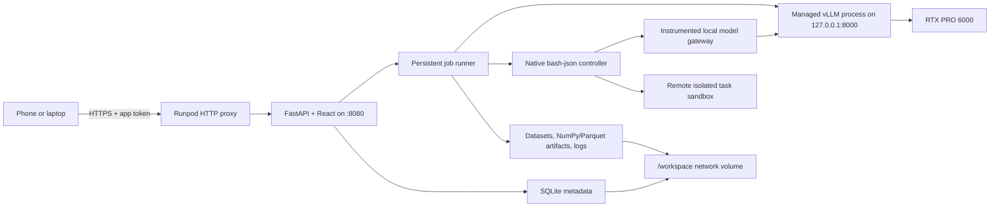

# MoE Tools Test Suite Roadmap

Status: active implementation and release-gating plan, updated 2026-08-11

Implementation status as of 2026-08-11:

- **A previous container crossed the first live boundary:** the authenticated
  Runpod proxy appliance and supported Qwen model ran on the target RTX PRO 6000,
  and the native agentic flow completed work through Daytona. That live use exposed
  two important defects: a transient browser fetch failure could abandon a still-
  running model-load job, and several expert-profile transitions were confusing or
  incorrect. This is evidence for the architecture, not acceptance of the current
  release candidate.
- **Durable job recovery is implemented in the current local candidate:** a model
  session and its queued job are persisted atomically before the API response;
  execution is scheduled and owned by the application rather than the response
  lifecycle; a disconnected response waiter cannot cancel it; identical model-load
  retries adopt the same job; and incompatible submissions return a typed conflict
  containing the recoverable active job. `GET /api/jobs/active` and the planned
  `starting` session make reload and process-restart state explicit.
- **Browser recovery is implemented locally:** job polling treats network/5xx/429
  failures as transient with bounded backoff, wakes on reconnect or tab visibility,
  discovers the server's active job after a reload, and adopts typed conflicts. The
  UI keeps the operation and last terminal error visible instead of reverting to
  “no model loaded” while server-side work continues.
- **Profile and comparison workflows are hardened locally:** proposals are scoped
  to baseline routing, changing the metric or budget invalidates stale proposals,
  a saved profile must be loaded before a paired rerun, saved comparisons update the
  archive immediately, and manual edits create a named immutable revision and close
  cleanly. Partial profiles now materialize omitted routed layers as “all experts
  eligible” while explicit empty layers remain invalid.
- **Agentic telemetry is de-duplicated exactly for verified multi-turn prefixes:**
  the gateway retains prompt/generated token IDs per trial, tokenizes each extended
  prompt, computes an exact common-token prefix, and asks the fork to omit only that
  prefix from returned routing rows. Ambiguous or unrelated prompts fail open to a
  zero skip, row counts are validated, and cache keys are isolated by trial so one
  task cannot borrow another task's prefix state.
- **Provider and process cleanup are hardened locally:** a remote Daytona create
  failure that yields no handle still triggers exact-ownership-label cleanup and is
  persisted as deleted or cleanup-pending. New work retries/blocks around pending
  cleanup. Managed vLLM runs in its own process group, shutdown escalates safely
  from `TERM` to `KILL`, startup reconciles only validated owned processes, and the
  Runpod hook no longer mistakes a reused stale PID for a healthy app.
- **Automated release gates are present:** GitHub CI runs backend Ruff and pytest,
  frontend Node contract tests and the production Vite build, plus deployment shell
  and JSON validation. A public-API acceptance canary can authenticate, adopt an
  active/unknown-outcome job, load the baseline, run an explicit fixture cohort,
  save and load a profile by ID, rerun the identical cohort, and validate the saved
  comparison. Its Daytona task is deliberately opt-in because it creates paid work.
- **Current local verification:** all 66 backend tests and all five frontend contract
  tests pass; backend Ruff and the production TypeScript/Vite build pass. Pytest has
  one dependency deprecation warning, and Vite has a non-blocking large-chunk warning
  for the 807 kB ECharts-heavy bundle. In the fork, the two scheduler boundary tests
  and two SamplingParams forwarding tests pass, as does the direct request-to-
  scheduler contract check; fork Ruff and format checks are clean.
- **Current release gate:** publish the candidate app image with the immutable fork
  revision, rerun the canary and targeted recovery/profile checks on the RTX PRO
  6000, run the bounded Daytona ladder, then explicitly confirm zero paid sandboxes
  and stop the Pod. The new release candidate must not be described as live-verified
  until this gate passes.

Approximate milestone accounting (local implementation, not production readiness):

| Milestone | Progress | Largest remaining gap |
| --- | ---: | --- |
| 0 · Local skeleton | 95% | Broader component/browser automation and CI image smoke |
| 1 · Runpod appliance | 90% | Current immutable-image proxy/volume/restart acceptance |
| 2 · Model lifecycle | 75% | Candidate recovery, stop/cancel, topology, and GPU acceptance |
| 3 · Benchmark engine | 84% | More standard adapters and browser-level regression coverage |
| 4 · Profile lab | 72% | Undo/redo, brush selection, and additional assisted strategies |
| 5 · Masked comparison | 74% | Routing redistribution, reports, and performance mode |
| 6 · Agentic foundation | 78% | Current RTX/Daytona gate, formal pairing, multi-trial profiles |
| 7 · Repository agentic | 10% | Full Harbor/Aider integration and public task adapters |
| 8 · Breadth/hardening | 18% | Failure injection, Playwright, migrations, and recovery drills |

The interactive MVP surface is roughly three quarters implemented. Production
readiness remains lower: an earlier build proved the Runpod/GPU/Daytona boundaries,
but the current hardening candidate still needs immutable-image acceptance and an
intentional teardown audit before it can replace that build.

This repository will contain a single-user research application for measuring how
expert eligibility changes affect a task-focused MoE model. The first useful
vertical slice is:

1. launch one repeatable Runpod Pod;
2. load the supported Qwen model;
3. run a fixed benchmark cohort while capturing expert routing;
4. inspect engagement and create an expert profile;
5. restart the model with that profile;
6. rerun the identical cohort and compare quality and behavior.

The application should make this loop easy and reproducible without hiding the
experimental constraints of the current fork.

## What already exists in `vllm-moe-tools`

This implementation began from the `stage_2` fork at commit `79df5217e`. That
original masking/telemetry history contains three relevant pieces:

- Version 1 expert-selection profiles with per-layer logical expert allowlists.
- Routed-expert capture returned through the OpenAI-compatible completions and
  chat-completions APIs.
- Float32 routing weights paired element-for-element with the routed expert IDs.

The runtime flags exposed by the fork are:

```text
--enable-return-routed-experts
--enable-return-routed-expert-weights
--moe-expert-selection-profile /path/to/profile.json
```

Telemetry is transported as base64-encoded NumPy arrays. IDs and weights have
shape `[tokens, routed_layers, top_k]`. The app will decode and aggregate these
arrays rather than changing vLLM's internal capture path in the first phase.

The current release-candidate fork commit
`729d4f23ae9cc27f797b8c13a9276565976637ed` extends the chat request contract with
an optional non-negative `routed_experts_prompt_start`. When routed capture is
enabled, the fork returns prompt routing beginning at that token offset followed by
generated-token routing. The app uses it only after exact token-prefix alignment;
ordinary clients omit it and preserve the original behavior. The container publish
workflow pins that full SHA; the resulting combined image remains part of the
outstanding live release gate. Negative offsets fail request validation; an offset
equal to or beyond the prompt length safely clamps to that length and returns no
prompt rows rather than tripping the scheduler.

The profile contract is intentionally small:

```json
{
  "version": 1,
  "layers": {
    "0": { "keep": [0, 1, 2, 3, 4, 5, 6, 7] }
  }
}
```

The fork validates layer IDs, expert IDs, duplicates, minimum `top_k`, and router
compatibility. It applies the eligibility mask before top-k selection and fails
closed on unsupported routing implementations.

### Important current limitations

- Profiles are bound during model load. Changing a profile means restarting the
  vLLM model process; this is not currently a hot runtime setting.
- Ineligible experts remain loaded. The current feature is behavioral pruning,
  not checkpoint compaction, expert offload, or a direct VRAM reduction.
- Routed telemetry has measurable memory, transport, and latency overhead. Quality
  runs should compare like with like; clean performance runs should disable capture.
- The exact modular/monolithic backend selected on the target GPU must be verified
  from the real startup logs. Eligibility deliberately rejects unsupported paths.
- The fork already contains a Runpod development image and shell wrappers. The app
  image should reuse their validated CUDA/PyTorch/precompiled-extension choices
  instead of independently inventing a second vLLM runtime.

These limitations will be visible in the UI. The product will use **masked** or
**eligible** for the current behavior and reserve **physically pruned** for a future
artifact that actually removes, compresses, or offloads weights.

## Product scope

### MVP goals

- Start the app from a custom Runpod Pod template.
- Reach it securely from a phone or laptop without an extra tunneling service.
- Select and load a model from a registry that initially exposes one enabled model.
- Show model lifecycle, hardware, runtime configuration, and MoE topology.
- Provide a compact chat interface for smoke tests.
- Browse, filter, sample, and manually select benchmark items.
- Run benchmark items as a durable background job with item-level progress.
- Record score, output, latency, errors, and expert routing for each item.
- Explore layer/expert engagement using a scalable interactive heatmap.
- Create, validate, clone, import, and export expert profiles.
- Restart the model with a profile and rerun an identical benchmark cohort.
- Compare base and masked runs with paired item-level and aggregate views.
- Persist datasets, model cache, runs, profiles, logs, and provenance across Pods.
- Treat multi-turn agentic coding as a first-class benchmark family through a native
  bounded controller and a replaceable remote-sandbox provider.
- Preserve `ATIF-v1.7` agent trajectories and associate every model inference with
  its expert-routing telemetry.

### Explicitly deferred

- Multiple simultaneous models or multiple concurrent GPU workers.
- Multi-user accounts, teams, and remote authorization providers.
- Physically rewriting checkpoints or proving VRAM savings from eligibility masks.
- Hot-swapping expert profiles without reloading vLLM.
- Automated black-box search over thousands of masks.
- Executing model-generated code inside the main application/model container.
- Embedding the full Harbor runtime or importing arbitrary Harbor task packs.
- Aider, Mini-SWE-Agent, Terminus-2, or another external agent scaffold.
- Formal paired-comparison statistics for agentic runs and multi-trial profile
  aggregation.
- Multi-node or tensor-parallel deployments.
- Selective quantization. The data model will leave room for it, but the first UI
  will not pretend that it is implemented.

## Decisions

### Deployment: persistent Runpod Pod

A Pod is a better fit than Runpod Serverless because the workflow is interactive,
stateful, and holds a large model warm while the user explores results. Serverless
would add cold starts and an awkward request/job boundary without removing the need
for persistent research artifacts.

The deliverables will include:

- one `linux/amd64` application image with immutable tags;
- a custom Pod template definition and a console setup guide;
- an optional script/API path to create or update the template;
- a bounded GPU acceptance checklist and cost/teardown guidance.

Initial template configuration:

| Setting | Initial value |
| --- | --- |
| GPU | 1x RTX PRO 6000 Blackwell Server Edition, 96 GB |
| App HTTP port | `8080/http` |
| SSH | `22/tcp`, for maintenance only |
| Internal vLLM port | `8000`, not publicly exposed |
| Container disk | 50 GB minimum |
| Persistent storage | 150 GB network volume mounted at `/workspace` |
| App data | `/workspace/moe-tools` |

The GPU's data center should be checked before creating the network volume because a
Runpod network volume is tied to one data center and restricts GPU placement.

### External access: Runpod HTTP proxy, not ngrok

The default URL will be:

```text
https://<pod-id>-8080.proxy.runpod.net
```

This is the best initial option because it is built into Pod templates, provides
HTTPS, requires no tunnel account or sidecar, and works from mobile and desktop
browsers. The proxy is public and does not add authentication, so the application
will require a user-supplied access token. After token entry it will issue an
`HttpOnly`, `Secure`, same-site session cookie; the token will not be placed in the
URL or stored in browser local storage.

The proxy has a 100-second connection limit. Model loads and benchmark runs will
therefore return a job ID immediately and expose short polling endpoints. Chat can
stream when practical but must degrade cleanly to polling. No core operation will
depend on a long-lived browser connection.

ngrok is not part of the default architecture. A custom domain or an identity-aware
proxy can be added later without changing the application because the frontend and
API are served from one origin.

### Application stack

**Backend:** Python 3.12, FastAPI, Pydantic, SQLAlchemy, and SQLite with one
application writer.

Python is the natural control plane for NumPy telemetry, Hugging Face datasets, and
vLLM process management. SQLite avoids running Redis or Postgres on a single-user,
single-Pod appliance. The database will use a rollback journal on the network volume
unless a target-filesystem test proves WAL locking is safe; SQLite WAL is not assumed
safe on network filesystems. Large artifacts will be files, not database blobs.

**Frontend:** React, TypeScript, Vite, TanStack Query, Apache ECharts, and a
purpose-built responsive CSS system. Native controls cover the current interaction
set; accessible headless primitives can be added when dialogs and complex overlays
arrive.

ECharts will render the 40-by-256 expert matrix on canvas, with zoom, filtering,
tooltips, selection, and mobile support. The production frontend will compile to
static files served by FastAPI so the public app is same-origin and only needs one
HTTP port.

**Visual direction:** warm off-white surfaces, ink-like text, restrained terracotta
and ochre accents, bundled serif display/body typography with a clean sans-serif for
data-dense controls, generous spacing, and minimal chrome. The tone should feel
homey and editorial while tables, filters, progress, and plots remain unambiguous.
Color will never be the only carrier of mask or score state.

The primary navigation will stay small:

- **Model:** load state, topology, runtime facts, and chat;
- **Benchmarks:** dataset browser, cohorts, and new-run setup;
- **Runs:** progress, results, routing analytics, and exports;
- **Profiles:** manual/assisted selection and profile history;
- **Compare:** paired base-versus-variant results;
- **System:** storage, logs, versions, security, and shutdown controls.

Desktop uses a quiet left rail; mobile uses a compact bottom bar and full-screen
drawers for expert details rather than shrinking desktop panels beyond usability.

### One app process, one managed vLLM child process

The app will own the model lifecycle instead of asking the user to manage shell
commands. Only one vLLM server can be ready at a time on the single GPU.



Model states will be explicit: `unloaded`, `starting`, `ready`, `stopping`, and
`failed`. Startup logs and readiness checks will stream into a persistent session
record. A profile or telemetry-mode change creates a new model session and restarts
vLLM. The UI will show this restart before the user confirms it.

The Runpod base image's `/start.sh` must remain in the startup chain so SSH and the
standard Pod services are not accidentally removed. An idempotent startup hook will
launch the web application automatically.

### Agentic execution: native controller, Harbor-compatible artifacts

Runpod Pods run from custom container images and do not provide a Docker daemon or
Docker Compose inside the GPU Pod. Agent-generated code and benchmark verifiers are
therefore never executed in the application/model container or through
Docker-in-Docker. Runpod documents this Pod boundary in its
[image-building guide](https://docs.runpod.io/tutorials/pods/build-docker-images).

The implemented scaffold is `bash-json-v1`, revision `1`, a small native loop that
accepts exactly one JSON shell action or finish action per model turn. Its control
process stays inside the application Pod, calls vLLM over loopback through an
instrumented gateway, and sends shell operations only to the selected sandbox
provider. Default limits are eight turns, eight commands, 32,768 tokens, and 300
seconds. This keeps the measured scaffold explicit and ensures every model inference
can be linked to the fork's routed-expert telemetry.

The artifact boundary is Harbor-compatible: trajectories use `ATIF-v1.7`, following
Harbor's [ATIF RFC](https://github.com/harbor-framework/harbor/blob/main/rfcs/0001-trajectory-format.md),
and the native task/provider contracts are designed to map to Harbor's
[task](https://www.harborframework.com/docs/tasks) and
[agent](https://www.harborframework.com/docs/agents) concepts. This is not yet an
embedded Harbor runtime. Full Harbor task-pack import/validation, Harbor-managed
jobs, Aider, Mini-SWE-Agent, and Terminus-2 are deferred integrations. When added,
each external scaffold and revision will remain a separate run-contract dimension;
results will never be silently pooled.

Two provider implementations exist:

- `fake` is an in-memory contract double. It returns only exact scripted command
  responses, returns exit `127` for anything else, and never invokes a local
  subprocess.
- `daytona` performs remote create/upload/exec/read/delete through the exact
  [`daytona==0.192.0`](https://pypi.org/project/daytona/0.192.0/) pin. Listing
  provider status is local; explicit preflight is a bounded read-only list request
  that creates no sandbox. See Daytona's
  [async SDK lifecycle](https://www.daytona.io/docs/en/python-sdk/async/async-daytona/).

The Daytona API key remains in the controller and is never passed to the agent task.
Real sandboxes are private and ephemeral, receive only task files plus an empty
environment/secrets map, carry controller/run/trial ownership labels, enforce the
requested deny/allowlist/public egress policy, and are verified before operations
and deletion. Cleanup polls until destruction is confirmed. If creation fails after
Daytona has allocated a sandbox but before it returns a handle, the controller now
performs an exact-label cleanup lookup; deletion is persisted as confirmed or as
`cleanup_pending`, never silently treated as complete. Sandbox session state,
timeouts, CPU/RAM/disk requests, verifier output, deletion failures, and sanitized
provider errors are persisted. An earlier build completed the ordinary Daytona
lifecycle; this harder no-handle failure path and the current candidate still need
the bounded live release gate.

### Model registry

The backend will use a model registry even though the first release has one enabled
entry. A registry entry will contain:

- Hugging Face model ID and optional pinned revision;
- display name and enabled/experimental status;
- vLLM arguments and default generation parameters;
- minimum GPU memory and recommended context limit;
- expected topology fields and a topology extractor;
- compatibility notes for telemetry, masking, quantization, and chat features.

The app will derive actual topology from the downloaded model configuration and
runtime facts, not hard-code the UI to 40 layers or 256 experts. A mismatch between
expected and actual topology will prevent profile application.

### Repository and image relationship

`moe-tools-test-suite` remains a separate product repository. The final image will
contain both repositories, with the fork pinned by full commit SHA. For local builds,
BuildKit will receive the sibling `../vllm-moe-tools` checkout as a named build
context. CI will check out the same pinned fork revision before building.

The image will build for `linux/amd64`, preserve the validated Runpod CUDA 13/PyTorch
2.9 base and precompiled-extension strategy from `docker/Dockerfile.runpod`, and copy
application code after heavy dependency layers. It will never use a floating
`latest` tag. Model weights, datasets, results, and caches will stay out of the image
and on `/workspace`.

The default registry target can be GHCR, while image coordinates remain configurable
for Docker Hub or another registry.

## Benchmark plan

The core abstraction is a benchmark adapter, not a hard-coded GSM8K screen. Each
adapter owns:

- dataset ID, revision, subset, split, and license metadata;
- item schema and searchable/filterable fields;
- stable item IDs;
- prompt rendering and prompt-template version;
- recommended deterministic generation settings;
- response parsing and scoring;
- aggregate and per-category metrics.

The runner will issue one OpenAI-compatible request per item in the first version.
This makes progress, cancellation, retry, scoring, and routing provenance easy to
understand. Controlled concurrency can be added after correctness is established.

### Initial benchmark options

| Benchmark | Purpose | Scoring | Phase |
| --- | --- | --- | --- |
| GSM8K | Small, interpretable math/reasoning smoke test | Extracted final-answer exact match | First vertical slice |
| Custom JSONL | User's actual target workflow | Exact, regex, multiple choice, or unscored review | First vertical slice |
| MMLU/MMLU-Pro | Subject-filterable knowledge and reasoning | Multiple-choice accuracy | Next adapter |
| IFEval | Instruction-following sensitivity | Published rule-based checks | Next adapter |
| Aider Polyglot | Fast multi-language code-editing and agent-harness smoke test | Executable verifier pass and agent-attempt metrics | First agentic adapter |
| FeatureBench Fast | Repository-level feature implementation | Published executable verifier and partial metrics | Primary agentic coding suite |
| Terminal-Bench 2.1 | Long-horizon terminal and engineering workflows | Per-task verifier reward and `pass@k` | Primary agentic breadth suite |
| Custom Harbor tasks | The user's actual repository and agentic workflows | User-authored executable verifier | First-class agentic feature |
| Random/ShareGPT | Serving throughput only | Latency and throughput, not quality | Performance mode |

GSM8K is the right first standardized adapter because item scoring is cheap and the
full baseline-to-profile loop can be tested without executing generated programs.
Custom JSONL is equally important to the product goal: specialization is only useful
if users can bring examples from the task they actually care about.

### Agentic coding benchmark strategy

Agentic coding is a major product track, but it should not be reduced to one
leaderboard number. The suite will use a ladder whose rungs stress different failure
modes and costs.

#### Implemented smoke rung: three native Python tasks

The current `smoke-python-v1` pack is an immutable, content-addressed native pack
with `fix-subtract`, `implement-slugify`, and `repair-json-cli`. Each task is Python
3.12 standard-library-only, requests no egress, has a 180-second limit, and is marked
with a passing oracle and failing no-op. This rung exists to validate controller,
sandbox, verifier, ATIF, routing, persistence, profile lineage, and cleanup plumbing;
three passes are not evidence of broad coding quality.

The pack is Harbor-compatible by design but is not a general Harbor task-pack
importer. The public suites and external agents below remain planned expansion after
the real three-task lifecycle is clean.

#### Planned 1. Aider Polyglot: integration and quick regression

Aider Polyglot contains 225 executable Exercism tasks across C++, Go, Java,
JavaScript, Python, and Rust. It is not a faithful substitute for long-horizon
repository work, but it is the best first integration target because it is small,
test-driven, multi-language, available through Harbor, and cheap enough for repeated
base/profile smoke cohorts.

Initial use:

- pin the Harbor dataset revision and the default external agent revision;
- ship a curated 12-task smoke cohort spanning the six languages;
- allow the complete 225-task cohort after the sandbox path is stable;
- report task pass rate, first-attempt/final pass, malformed tool actions, turns,
  tokens, commands, wall time, and routing engagement;
- optionally add Aider itself as a separately fingerprinted scaffold for comparison
  with the benchmark's native harness; do not pool those results with the default
  agent.

#### Planned 2. FeatureBench Fast: primary feature-development signal

FeatureBench measures complex feature implementation rather than only bug repair. Its
Fast split has 100 CPU-only instances and is designed for quicker evaluation, while
the broader benchmark includes longer and GPU-dependent tasks. It already supports
Mini-SWE-Agent, OpenHands, Codex, and other mainstream scaffolds, and Harbor documents
a FeatureBench adapter.

Initial use:

- use only the pinned CPU Fast split so the RTX PRO 6000 remains dedicated to vLLM;
- begin with a manually verified 10-task cohort covering different repositories and
  feature shapes;
- preserve the benchmark's own passed/resolved and partial verifier outputs;
- expand to the full Fast split after oracle verification on the chosen sandbox.

This is the most relevant public benchmark for the stated goal because feature work
requires codebase discovery, planning, multi-file editing, tests, and recovery over a
longer trajectory.

#### Planned 3. Terminal-Bench 2.1: terminal autonomy and workflow breadth

Terminal-Bench 2.1 is the corrected, continuously validated revision of Terminal-
Bench 2.0. Its 89 tasks cover debugging, building, data processing, security, Git,
servers, and other realistic terminal work. Not every task is software development,
so the application will expose task metadata and ship a coding/engineering-focused
cohort before offering the complete set.

Initial use:

- pin `terminal-bench/terminal-bench-2-1` and its Harbor revision;
- curate an approximately 15-task engineering cohort with verified oracle success on
  the selected sandbox provider;
- use the minimal agent scaffold for model-centered comparisons and Terminus-2 as an
  optional standard-scaffold comparison;
- use one attempt for exploration, at least three for profile confirmation, and five
  only for an official leaderboard-compatible experiment.

Terminal-Bench 3 is still under construction as of this roadmap update, so it is not
a reproducibility target yet.

#### Planned 4. Custom Harbor tasks: task-specific specialization

Public benchmarks are useful calibration, but the product's purpose is to specialize
models for a real workflow. The app will therefore support importing or authoring a
Harbor-compatible task pack with:

- a repository snapshot or pinned source revision;
- a natural-language instruction and optional context files;
- container/environment definition;
- setup, test, and verifier commands;
- timeout and resource limits;
- optional oracle solution for environment validation;
- tags such as language, repository, task type, and difficulty.

The UI will validate that the oracle passes and a no-op fails before a custom task is
eligible for profile-selection runs. Private source code is sent to the configured
sandbox provider, so the UI must display that data boundary and later support a
self-hosted provider for sensitive repositories.

#### Planned 5. Later research/reference suites

- **SWE-rebench V2:** promising for fresher, contamination-aware, multi-language
  repository tasks. Add it after its task images and evaluator are proven against a
  pinned Harbor adapter/provider combination.
- **SWE-Lancer Diamond:** valuable for larger freelance feature/bug tasks and
  economic-value scoring, but expensive enough to remain a later validation suite.
- **SWE-bench Verified:** retain only for historical comparability. It is increasingly
  contaminated and an audit found many residual test/specification problems.
- **SWE-bench Pro:** retain as an opt-in reference with prominent warnings. A July
  2026 audit estimated roughly 30% of the public tasks are broken and retracted an
  earlier recommendation to use it as the primary successor to SWE-bench Verified.
- **HumanEval/LiveCodeBench-style generation:** useful one-request coding controls,
  but they do not measure repository navigation or agent recovery and are not a
  substitute for the agentic track.

No expert profile will be presented as “coding-specialized” from a single public
suite. A candidate coding profile should train its selection statistics on one or
more target cohorts and be validated on a held-out task pack from a different source.

### Agentic run contract

An agentic task is one benchmark item with multiple model calls and environment
actions. The controller stores an `ATIF-v1.7` trajectory plus:

- benchmark/task/environment image revision and verifier result;
- agent name, source revision, prompt, tool schema, and all agent arguments;
- turn, token, inference, command, test, timeout, and wall-clock budgets;
- each thought/message, tool or shell action, observation, exit code, and truncation;
- final patch/repository diff and collected verifier artifacts;
- one inference record per model call linked to routing IDs/weights;
- task reward, partial metrics, termination cause, and sandbox/provider metadata.

Every model turn passes through an instrumented local gateway. It forwards the
request to the current model runtime, decodes the fork's custom routing arrays,
stores a routing artifact and inference record against the trajectory step, and
returns the ordinary response to the controller. The implemented trial view exposes
the trajectory, verifier/artifact records, inference list, and aggregate routing
heatmap.

Multi-turn prompts often repeat conversation history. The current gateway avoids
counting that history again when it can prove an exact token prefix: it retains the
prior prompt and generated token IDs per trial, asks the runtime tokenizer for the
next extended prompt, computes the exact common prefix, and sends that boundary to
the fork through `routed_experts_prompt_start`. The fork then returns routing for
only the novel prompt suffix plus the new generated tokens. Telemetry row counts are
checked against that token contract. Prefix state is keyed by unique trial ID; a new
trial, unrelated prompt, clipped context, missing tokenization response, or ambiguous
alignment uses offset zero rather than guessing.

The corrected aggregate is therefore **de-duplicated served-token engagement** for
verified chat-history extensions. It is still not semantic attribution, causal
importance, or a generated-token-only view. Semantic phase and token-text views
remain deferred until their alignment contracts have equivalent integration tests.

The implemented agent-run contract fingerprint covers the immutable task pack and
selected task revisions, agent/system/tool revisions, generation settings, budgets,
sandbox provider/policy, attempts, and seed. The model-session/profile fingerprint is
stored separately so the same contract can be rerun under a different profile. A
formal agentic paired-comparison resource and UI remain deferred; the release gate
must compare exported runs and reject any unintended contract mismatch manually.

Agent outcomes are stochastic even at low temperature. The current smoke ladder uses
one attempt per task only to validate plumbing. Conclusions about a profile should
use repeated attempts and eventually report `pass@k`, mean reward, confidence
intervals, and success/failure transitions. The UI must never silently mix task
attempts or choose the best attempt after the fact.

The benchmark browser will support split/category filters, text search, seeded
sampling, manual checkboxes, select-all-from-filter, and saved cohorts. A run stores
the exact selected item IDs; a masked rerun defaults to that immutable cohort.

### Reproducibility contract

Every run will record:

- application, image, and fork commit/digest;
- model ID, Hugging Face revision, and model-config hash;
- GPU name, VRAM, driver, CUDA, PyTorch, and vLLM versions;
- effective vLLM arguments and backend selection from startup logs;
- dataset ID, revision, split, selected item IDs, and local snapshot hash;
- prompt-template/scorer version and generation parameters;
- seed, start/end times, failures, and cancellation reason;
- exact expert-profile JSON and hash, or `baseline`;
- telemetry mode and raw-artifact retention policy.

The comparison screen will calculate a compatibility fingerprint. It will warn or
refuse a strict paired comparison when dataset items, prompts, model revision, or
generation parameters differ.

### Quality and performance are separate run modes

- **Analysis run:** routing IDs and weights enabled; quality score and expert
  engagement are valid; latency is diagnostic only.
- **Performance run:** routing capture disabled; use vLLM's serving benchmark path;
  collect throughput, total latency, and GPU metrics.

This prevents the application from presenting capture overhead as a pruning effect.

## Expert analytics and profile creation

### Stored analytics

Raw telemetry can grow quickly, so the backend will aggregate during each item and
store optional compressed raw arrays outside SQLite. Initial metrics are:

- selection count and selection rate by layer/expert;
- summed routing weight (routing mass);
- mean weight conditional on selection;
- number and percentage of items touching each expert;
- per-layer entropy/concentration and active-expert count;
- co-selection counts for selected drill-downs;
- correct-versus-incorrect engagement slices;
- successful-versus-failed agent trajectory engagement;
- per-turn and per-inference engagement for agentic tasks;
- base-versus-masked routing overlap and redistribution.

Token-phase or token-text views will only ship after an integration test proves the
alignment between API token IDs and every telemetry row for the target model. The
initial contract is item- and layer-level aggregation.

### Profile editor

The main view will be a zoomable layer-by-expert heatmap with linked summary charts.
Users can click, brush, select rows/columns, inspect an expert, undo/redo, and clone a
profile. The UI will always show:

- eligible experts per layer and total eligible slots;
- required minimum (`top_k`) and any grouped-router constraints;
- observed routing mass and item coverage retained by the current selection;
- experts never observed in the selected run;
- a clear statement that current estimated parameter reduction is theoretical.

Profiles are immutable after use in a run. Editing creates a new revision. Import and
export use the fork's exact version 1 JSON format.

### Assisted selection strategies

The first useful strategies are deterministic and explainable:

1. **Fixed budget:** keep the top `K` experts by selection count or routing mass in
   every layer.
2. **Cumulative mass:** keep the smallest set per layer that covers a requested
   percentage of observed routing mass, with a `top_k` floor.
3. **Item coverage:** greedily retain experts that preserve a requested amount of
   the observed routed slots across the chosen items.
4. **Correct-only emphasis:** rank from correct items, while displaying what routing
   mass from incorrect items would be lost.
5. **Target lift (later):** compare a target cohort with a general/reference cohort
   and favor experts disproportionately engaged by the target task.
6. **Successful trajectory emphasis (agentic):** rank from successful attempts while
   preserving a held-out task pack and displaying engagement lost from failed or
   recovery-heavy trajectories.

Each proposal produces a preview, rationale, coverage metrics, validation results,
and a diff from its parent profile. Assisted selection will not claim causal expert
importance; only ablation or masked reruns provide causal evidence.

The agentic slice currently implements only the fixed-budget path from one trial:
`POST /api/trials/{trial_id}/profile-proposal` proposes 64 experts per layer by
`routing_mass` by default. Saving it with `source="agentic"` and `source_trial_id`
preserves lineage; loading it through the existing model-session flow restarts vLLM.
Multi-trial aggregation and a one-click agentic paired-comparison workflow remain
future work.

## Result and comparison experience

A run detail page will show status, provenance, aggregate score, category scores,
per-item outputs, errors, engagement, and its exact model variant.

A paired comparison will show:

- base score, masked score, absolute delta, and relative delta;
- paired bootstrap confidence interval when sample size permits;
- item transitions: pass-to-pass, pass-to-fail, fail-to-pass, fail-to-fail;
- filterable per-item output diffs;
- eligible expert counts by layer and theoretical retained expert fraction;
- routing concentration and base/masked overlap;
- for agentic runs: task reward, `pass@k`, turns, commands, test attempts, token
  usage, termination causes, patch statistics, and trajectory-step routing;
- diagnostic latency for analysis runs or clean performance metrics for performance
  runs;
- provenance mismatches and warnings.

The primary action on a baseline analysis run is **Create expert profile**. The
primary action on a profile is **Load and rerun cohort**. The app will make that
workflow obvious without preventing ad hoc exploration.

## Persistence model

SQLite stores relational metadata and state. Files under `/workspace/moe-tools`
store larger or portable artifacts.

Proposed entities:

- `model_sessions`: model/profile/runtime lifecycle and logs;
- `dataset_snapshots`: dataset revision, local files, and content hash;
- `benchmark_cohorts`: immutable selected item IDs and filters;
- `benchmark_runs`: configuration, status, score, and provenance;
- `run_items`: prompt, response, parsed answer, score, timing, and error;
- `agent_trials`: scaffold, sandbox, budgets, reward, termination, patch, and
  verifier metadata for a multi-turn task attempt;
- `trajectory_steps`: normalized ATIF messages, actions, observations, and metrics;
- `inference_calls`: model request/response metadata linking a trajectory step to
  routed-expert artifacts;
- `sandbox_sessions`: provider lifecycle, resource limits, image digest, and cleanup
  state without persisted provider secrets;
- `routing_summaries`: aggregate layer/expert statistics;
- `routing_artifacts`: paths and hashes for compressed per-item arrays;
- `expert_profiles`: immutable profile revisions and lineage;
- `jobs`: durable model-load, benchmark, aggregation, and export work.

A future `model_variants`/`interventions` layer can associate a run with expert
eligibility, selective quantization, offload, or a physically materialized
checkpoint without changing the benchmark and comparison tables.

Large arrays will use compressed NumPy initially; Parquet will be used for tabular
aggregates and exports. The app will expose a JSON/CSV/Parquet export so results are
not trapped in the UI.

## API shape

The initial internal API will be resource-oriented and job-based:

```text
POST /api/session/login
GET  /api/system/status
GET  /api/models
POST /api/model-sessions
GET  /api/model-sessions/{id}
POST /api/model-sessions/{id}/stop
POST /api/chat

GET  /api/benchmarks
GET  /api/benchmarks/{id}/items
POST /api/cohorts
POST /api/runs
GET  /api/runs/{id}
POST /api/runs/{id}/cancel
GET  /api/runs/{id}/routing

GET  /api/agents
GET  /api/sandbox-providers
POST /api/sandbox-providers/{id}/preflight
GET  /api/agent-task-packs
GET  /api/agent-task-packs/{id}/tasks
POST /api/agent-runs
GET  /api/agent-runs/{id}
POST /api/agent-runs/{id}/cancel
GET  /api/agent-runs/{id}/export
GET  /api/trials/{id}
GET  /api/trials/{id}/trajectory
GET  /api/trials/{id}/export/atif
GET  /api/trials/{id}/routing
GET  /api/trials/{id}/artifacts
POST /api/trials/{id}/profile-proposal

POST /api/profiles/propose
POST /api/profiles
GET  /api/profiles/{id}
POST /api/comparisons

GET  /api/jobs/active
GET  /api/jobs/{id}
GET  /healthz
GET  /readyz
```

Job-creating endpoints persist their resource/job transaction and schedule owned
execution before returning `202`. A duplicate identical model-load request returns
the same job; a cross-kind or incompatible request returns a typed `409` with the
active job and recovery URL. The browser polls model sessions, jobs, and runs, and
also discovers `/api/jobs/active` after reload or reconnect. FastAPI publishes these
contracts through OpenAPI; the current frontend uses explicit TypeScript
request/response types rather than a generated client.

## Implementation milestones

### Milestone 0: contracts and local skeleton

- Establish `backend/`, `frontend/`, `docker/`, `scripts/`, and `tests/` layout.
- Pin Python and Node dependencies; use `uv` for Python commands.
- Add model-registry, profile, run, and routing schemas.
- Build a fake vLLM server fixture that returns realistic base64 `.npy` telemetry.
- Add a synthetic model topology and benchmark fixture for GPU-free development.
- Add CI for backend tests, frontend tests, linting, and an amd64 image build.

Acceptance: a developer can run the app locally in mock mode, view a synthetic model,
run fixture items, and create a valid version 1 profile.

### Milestone 1: Runpod appliance and secure access

- Layer the app over the fork's validated Runpod runtime.
- Preserve `/start.sh`; add an idempotent app startup hook.
- Serve frontend/API on `0.0.0.0:8080`; keep vLLM on loopback port 8000.
- Add access-token login, secure cookies, CSRF protection, input limits, and basic
  rate limiting.
- Persist logs, state, and caches under `/workspace/moe-tools`.
- Add template definition, environment-variable reference, build/push script, and
  launch/teardown documentation.
- Add health/readiness endpoints and an outside-the-Pod proxy smoke test.

Acceptance: a fresh Pod created from the template exposes a login screen at the
Runpod proxy URL, survives an app restart, and does not expose vLLM publicly.

### Milestone 2: model lifecycle, topology, and chat

- Implement the one-model registry and managed vLLM subprocess.
- Surface download/startup progress, tail logs, errors, cancellation, and readiness.
- Parse actual model topology and runtime/backend details.
- Render the topology summary and empty expert matrix.
- Add a small chat interface with clear model/profile state.
- **Implemented locally:** persist the planned model session with its job before
  response, dispatch independently of the HTTP waiter, expose active-job discovery,
  adopt idempotent reloads/conflicts, and reconcile interrupted session/job pairs.
- **Implemented locally:** isolate vLLM in an owned process group, validate stale
  process metadata, and stop the complete group during cancellation or shutdown.

Acceptance: the supported Qwen model can be selected, loaded, inspected, chatted
with, stopped, and reloaded from the UI.

### Milestone 3: benchmark engine and routed telemetry

- Implement durable serialized jobs and item-level progress.
- Add benchmark browsing, cohort selection, GSM8K, and Custom JSONL.
- Decode, validate, and aggregate expert ID/weight arrays per item.
- Store full run provenance and optional compressed raw telemetry.
- Add run detail, item inspection, error handling, cancellation, and export.
- Establish deterministic benchmark defaults for comparison runs.

Acceptance: a selected 10-item GSM8K cohort produces a score, item results, and a
40-by-256 engagement view after browser refresh or reconnect.

### Milestone 4: profile lab

- Implement the canvas heatmap and linked metrics.
- Add manual selection, bulk actions, undo/redo, validation, lineage, import/export,
  and immutable revisions.
- Add fixed-budget, cumulative-mass, and item-coverage proposals.
- Preview observed coverage and theoretical retained expert fraction.
- Make router constraints and unsupported backends actionable.

Acceptance: a user can turn a baseline run into a valid profile without editing JSON,
while still being able to inspect and override every assisted choice.

The current editor implements per-layer toggles and bulk actions, partial-profile
materialization, top-k validation, immutable revision saves, import/export, and
lineage. It closes after a successful save and reports the new revision. Undo/redo
and brush selection remain real gaps rather than implied capabilities.

### Milestone 5: masked rerun and comparison

- Restart vLLM with the selected profile and record a new model session.
- Clone the original cohort and exact run configuration.
- Run the masked benchmark with live progress.
- Add compatible-run checks, paired score analysis, item transitions, output diffs,
  routing redistribution, and exportable comparison reports.
- Add a capture-disabled performance path using the existing vLLM benchmark wrapper.

Acceptance: from one baseline run, a user can create a profile, load it, rerun the
same cohort, and understand both the quality delta and eligibility reduction.

### Milestone 6: agentic coding foundation

- **Implemented:** native `bash-json-v1` scaffold with bounded JSON shell actions.
- **Implemented:** `ATIF-v1.7` models/exports and a per-inference instrumented local
  model gateway linked to routed-expert artifacts.
- **Implemented:** provider status/preflight plus a fake provider that cannot execute
  host subprocesses and a lazy Daytona adapter pinned to `0.192.0`.
- **Implemented:** controller-owned credentials, private ephemeral sandboxes, empty
  task env/secrets, ownership labels, network policy, bounded I/O, and confirmed
  deletion.
- **Implemented:** durable run/trial/sandbox/inference state, cancellation and
  restart reconciliation, artifact manifests, trajectory/routing views, and export.
- **Implemented:** canonical verifier restoration with isolated Python execution,
  plus startup recovery that deletes only exact-label interrupted Daytona sandboxes
  and blocks new work while retryable cleanup remains pending.
- **Implemented:** handle-less remote-create failure recovery by exact ownership
  labels, with cleanup completion or `cleanup_pending` persisted before trial exit.
- **Implemented:** exact multi-turn prompt-prefix de-duplication with per-trial token
  state, ambiguity fallback, telemetry row validation, and a fork request contract.
- **Implemented:** immutable `smoke-python-v1` with three oracle-pass/no-op-fail tasks.
- **Implemented:** one-trial routing proposal → agentic profile lineage → model
  profile reload → same-task rerun path.
- **Remaining:** real RTX/Daytona create/upload/exec/read/delete and cleanup
  acceptance for the current candidate, failure-injection of the no-handle cleanup
  path, formal paired comparison, multi-trial profile aggregation, and a periodic
  cleanup janitor beyond startup/new-run retries.

Acceptance for this milestone is now the seven-trial paid ladder: one Daytona canary,
three baseline tasks, one representative-trial profile reload, and the identical
three masked tasks, all with valid ATIF/routing/verifier artifacts and no remote
sandbox left behind. This is intentionally smaller than a public benchmark claim.

### Milestone 7: repository-level agentic coding

- Integrate the full pinned Harbor runtime/task adapters after validating the native
  provider and artifact boundaries.
- Add Aider or Mini-SWE-Agent as an explicitly versioned external scaffold and add
  Aider Polyglot with a curated 12-task smoke cohort.
- Add FeatureBench Fast with a verified 10-task starter cohort and full Fast split.
- Add Terminal-Bench 2.1 with a verified coding/engineering cohort and full dataset
  access.
- Add Harbor-compatible custom task-pack authoring/import and oracle/no-op checks.
- Add repeated attempts, `pass@k`, mean reward, bootstrap intervals, and explicit
  attempt pairing.
- Add successful-trajectory and target-versus-reference profile proposals.
- Add sandbox resource/cost estimates, concurrency controls, preflight image checks,
  controlled network policies, and artifact retention settings.
- Add Terminus-2 as a second pinned scaffold without pooling it with the default.
- Evaluate SWE-rebench V2 and SWE-Lancer Diamond as later adapters; keep SWE-bench
  Verified/Pro reference-only with data-quality warnings.

Acceptance: a user can derive a profile from one agentic coding task pack, validate it
on a held-out repository-level pack, and inspect whether quality loss comes from model
answers, tool use, recovery behavior, budget exhaustion, or verifier/environment
failure.

### Milestone 8: benchmark breadth and hardening

- Add MMLU/MMLU-Pro and IFEval adapters.
- Add target-versus-reference assisted selection.
- Add storage retention controls, backup/export/import, and migration tooling.
- Add responsive Playwright coverage for phone and laptop layouts.
- Add failure-injection tests for model OOM, bad profiles, corrupt telemetry,
  interrupted jobs, proxy reconnects, and full disks.
- Add resource telemetry and clearer cost/storage controls.
- Add a one-request coding control only if it provides signal not already covered by
  Aider Polyglot.

Acceptance: the appliance is recoverable, reproducible, and useful for more than one
task family without weakening the first end-to-end workflow.

### Later: turn behavioral masks into smaller artifacts

Once experiments identify stable expert profiles, add a separate materialization
pipeline. Candidate directions include checkpoint compaction, expert weight offload,
lazy loading, and per-expert quantization. This must report actual GPU memory, host
memory, disk size, load time, and throughput rather than inferring savings from the
allowlist. The existing run/profile provenance should make those variants directly
comparable with the logical-mask experiments.

## Test strategy

### GPU-free tests

- Profile-schema round trips and fork-compatible validation fixtures.
- Telemetry decode, shape/dtype checks, aggregation, and corruption handling.
- Dataset pinning, item selection, prompt rendering, scoring, and cohort hashing.
- Run compatibility fingerprints and paired comparison statistics.
- Job state transitions, cancellation, crash recovery, and database migrations.
- Atomic model-load session/job submission, identical retry adoption, typed
  cross-kind conflicts, dropped-response shielding, reload discovery, and shutdown
  interruption persistence.
- Model-process lifecycle against a fake OpenAI-compatible server.
- Owned process-group `TERM`/`KILL`, stale PID reuse, cancelled startup, and
  app-startup process reconciliation without touching unrelated processes.
- Instrumented per-inference agent-gateway linkage using fake multi-turn model
  responses and routing arrays.
- Native task-pack validation/fingerprints, `ATIF-v1.7` construction/export, trial
  recovery, and sandbox cleanup against a fake environment provider.
- Exact cumulative-token prefix de-duplication across multiple agent turns, plus
  separate-trial, unrelated-prompt, clipped-context, and invalid-row fallbacks.
- Fake-provider tests that prove unscripted commands fail closed without invoking a
  local process, plus mocked Daytona contract tests for preflight, ownership,
  upload/exec/read, redaction, timeout, deletion, and handle-less create cleanup.
- Frontend API contract tests for transient retry, terminal-job preservation, typed
  active-job adoption, and partial-profile editing semantics.
- Docker startup and same-origin API smoke tests.

The release canary under `scripts/acceptance_canary.py` is a separate public-API
gate rather than a unit test. It redacts its configured token, uses bounded polling,
adopts an already active job or an interrupted submission outcome, validates every
resource/provenance transition in the base-to-profile loop, and leaves its Daytona
step disabled unless `--daytona` is explicitly supplied.

### Target-GPU acceptance tests

1. Create a Pod from the template and verify the proxy URL from outside the Pod.
2. Authenticate and load the pinned Qwen revision.
3. During model load, interrupt or reload the browser and require it to rediscover
   and adopt the same active job without creating a second vLLM process.
4. Confirm GPU/backend/topology facts and that the routing path supports eligibility.
5. Complete one chat request.
6. Run the public-API acceptance canary's explicit fixture cohort, profile-by-ID
   reload, identical masked cohort, and persisted paired comparison.
7. Run a 10-item GSM8K baseline with ID/weight capture.
8. Create a conservative profile that keeps at least `top_k` experts per layer.
9. Restart with the profile and rerun the exact cohort.
10. Verify comparison provenance, scoring, telemetry, exports, and persisted state.
11. Run a small capture-disabled baseline/profile performance comparison.
12. Stop and restart the Pod, then verify model cache and application state survive.

### Agentic acceptance tests

An earlier image exercised the target RTX PRO 6000 and ordinary Daytona lifecycle.
The current release candidate changes job ownership, telemetry slicing, process
cleanup, and the handle-less sandbox failure path, so its paid gate starts fresh. It
is intentionally serialized, uses one attempt, and stops at the first cleanup or
provenance failure:

1. **Boot and pin:** deploy one immutable image with the agentic Runpod template,
   secret references, and intended network volume. Require `/readyz`, authenticated
   UI access, a ready baseline model session, and recorded image/fork/model/runtime/
   GPU provenance.
2. **Preflight:** call `POST /api/sandbox-providers/daytona/preflight`. Require
   configured, reachable, authenticated, and ready; verify the sanitized response has
   the expected host/region, no credential, and that the read-only list call created
   no sandbox.
3. **Raw one-task canary:** run only `fix-subtract` from `smoke-python-v1` with
   `bash-json-v1`, Daytona, `attempts=1`, `seed=0`, the baseline session, and recorded
   generation/budgets. Require reward `1`, passing verifier, valid `ATIF-v1.7`, at
   least one linked inference/routing artifact, remote-only code/test execution, and
   confirmed sandbox deletion.
4. **All-three baseline:** run `fix-subtract`, `implement-slugify`, and
   `repair-json-cli` with the identical contract. Require 3/3 for this plumbing gate,
   complete trajectory/verifier/routing artifacts, export the run, and require zero
   owned Daytona sandboxes.
5. **Derive and reload:** select one representative successful baseline trial; call
   its profile-proposal endpoint with `keep_per_layer=64&metric=routing_mass`; save
   the result with `source="agentic"` and that `source_trial_id`. Record fingerprint,
   lineage, metric, and observed mass, load it, and require a new ready model session
   with the expected profile ID/document; require the masked run to report the saved
   fingerprint. This profile is single-trial-derived, not a three-task aggregate.
6. **Same-three masked:** rerun the exact pack revision, three task IDs/order, agent
   revision, provider, attempts, seed, generation, and budgets using only the new
   profile-backed session. Require complete artifacts and zero sandbox leaks. Export
   both runs and compare reward/pass, turns, commands, tokens, termination, and
   routing descriptively; formal paired statistics are not implemented yet.
7. **Teardown:** verify no Daytona sandbox retains the controller/run/trial ownership
   labels, stop or terminate the GPU Pod, and retain the network volume only
   intentionally.

This ladder is seven paid task trials total (one canary, three baseline, three
masked). Full Harbor/Aider, cancellation/orphan recovery against live infrastructure,
public benchmark cohorts, repeated attempts, and held-out validation follow only
after this gate passes.

Before calling deployment complete, readiness must be verified with a real browser or
HTTP request through Runpod's public proxy, not only with the Pod's `Running` status.

## Security and operational guardrails

- Require `MOE_TOOLS_AUTH_TOKEN` at startup; reject an empty/default token.
- Never expose port 8000 through the Pod template.
- Never log or return `HF_TOKEN`, registry credentials, or the app auth token.
- Validate imported profile paths and JSON; write only under the application data
  root using generated IDs.
- Cap upload size, benchmark concurrency, output tokens, and retained raw telemetry.
- Treat benchmark prompts and model output as untrusted content in the browser.
- Do not execute generated code in the main app container.
- Use remote sandboxes for all agent code/test execution; never assume Docker-in-
  Docker is available on the Runpod GPU Pod.
- Keep sandbox-provider credentials in the controller, redact them from logs, and do
  not forward them to agents.
- Disable or allowlist task egress where benchmark setup permits, and record the
  effective network policy in every trial.
- Enforce per-trial CPU, RAM, disk, time, turn, and token limits plus a global
  concurrency ceiling.
- Delete sandboxes after verification; recover exact-label orphans at startup and
  before new work; add a periodic ownership-guarded reaper before production use.
- Record subprocess command lines after redacting secrets.
- Put managed app/vLLM subprocesses in owned process groups, validate ownership
  before signaling them, and never trust a PID file alone after restart.
- Provide explicit model-stop, Pod-stop, and Pod-terminate guidance; note that the
  independent network volume continues billing and persists after termination.
- Use immutable image tags/digests and record them in every run.

## Questions requiring confirmation

The initial model, target GPU, registry, and first sandbox provider are resolved:
`Qwen/Qwen3.6-35B-A3B-FP8`, one 96 GB RTX PRO 6000 Blackwell Server Edition, GHCR
under `sampazdan` with immutable tags, and Daytona for the bundled smoke pack. No
remaining question blocks the current release-candidate gate. These product-policy
questions should be answered before broadening usage:

1. **Private-code boundary:** will custom agent tasks contain private repositories?
   If so, the initial provider and retention policy must be approved for that data,
   or custom private tasks should wait for a self-hosted sandbox.
2. **Raw telemetry retention:** keep raw per-item arrays indefinitely, keep them only
   for selected runs, or retain aggregates by default and raw data on opt-in? The
   planning default is compressed raw data for analysis runs with an explicit delete
   control.
3. **Access model:** is a single shared token sufficient for the first version? The
   roadmap assumes one researcher and no public sharing.
4. **Long-running cleanup policy:** how often should a periodic Daytona orphan janitor
   run, and what retention window should apply to failed sandbox metadata? Startup
   and pre-run exact-label cleanup are implemented, but a periodic worker is not.

## Definition of MVP complete

The MVP is complete when a new user can start from a documented custom Pod template,
open the authenticated application on a phone or laptop, load the verified model,
select and run benchmark items, understand expert engagement, create a valid profile,
rerun the same cohort with the mask active, and inspect/export a reproducible paired
comparison—without opening a shell after Pod launch.

## Definition of agentic coding feature complete

The agentic feature is complete when the same UI can select a pinned agentic task
cohort, run it through a fixed agent scaffold in isolated remote sandboxes, display
live trial progress and complete trajectories, associate each inference with expert
routing, create a profile from successful target-task engagement, rerun an identical
held-out cohort with that profile, and compare verifier-backed quality and agent
behavior without executing generated code in the model Pod.

## Research references

- [Runpod Pod templates](https://docs.runpod.io/pods/templates/overview)
- [Runpod HTTP proxy and exposed ports](https://docs.runpod.io/pods/configuration/expose-ports)
- [Runpod storage types](https://docs.runpod.io/pods/storage/types)
- [Runpod network volumes](https://docs.runpod.io/storage/network-volumes)
- [vLLM benchmark datasets](https://docs.vllm.ai/en/stable/api/vllm/benchmarks/datasets/datasets/)
- [vLLM benchmark CLI](https://docs.vllm.ai/en/stable/benchmarking/cli/)
- [Qwen3.6-35B-A3B-FP8 model card](https://huggingface.co/Qwen/Qwen3.6-35B-A3B-FP8)
- [Harbor agent evaluation framework](https://github.com/harbor-framework/harbor)
- [Harbor v0.20.0 release](https://github.com/harbor-framework/harbor/releases/tag/v0.20.0)
- [Harbor tasks](https://www.harborframework.com/docs/tasks)
- [Harbor agent integrations](https://www.harborframework.com/docs/agents)
- [Harbor cloud sandbox providers](https://www.harborframework.com/docs/run-jobs/cloud-sandboxes)
- [Harbor ATIF trajectory format](https://github.com/harbor-framework/harbor/blob/main/rfcs/0001-trajectory-format.md)
- [Daytona Python SDK](https://www.daytona.io/docs/en/python-sdk/)
- [Daytona async SDK lifecycle](https://www.daytona.io/docs/en/python-sdk/async/async-daytona/)
- [Daytona API keys](https://www.daytona.io/docs/api-keys/)
- [Daytona network limits](https://www.daytona.io/docs/en/network-limits/)
- [Daytona Python SDK 0.192.0](https://pypi.org/project/daytona/0.192.0/)
- [Mini-SWE-Agent](https://github.com/SWE-agent/mini-swe-agent)
- [Aider Polyglot benchmark](https://github.com/Aider-AI/aider/blob/main/benchmark/README.md)
- [FeatureBench](https://github.com/LiberCoders/FeatureBench)
- [Terminal-Bench 2.1](https://github.com/harbor-framework/terminal-bench-2-1)
- [SWE-rebench](https://github.com/SWE-rebench)
- [SWE-Lancer](https://openai.com/index/swe-lancer/)
- [OpenAI audit of SWE-bench Pro](https://openai.com/index/separating-signal-from-noise-coding-evaluations/)
- [Why SWE-bench Verified no longer measures frontier coding](https://openai.com/index/why-we-no-longer-evaluate-swe-bench-verified/)
- [Runpod: Docker/Compose is unavailable inside a GPU Pod](https://docs.runpod.io/tutorials/pods/build-docker-images)
